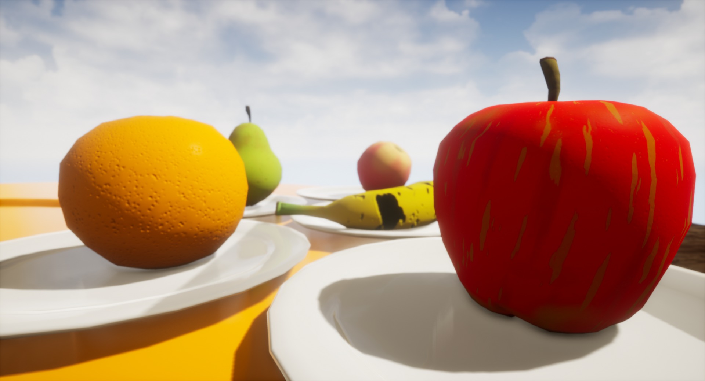
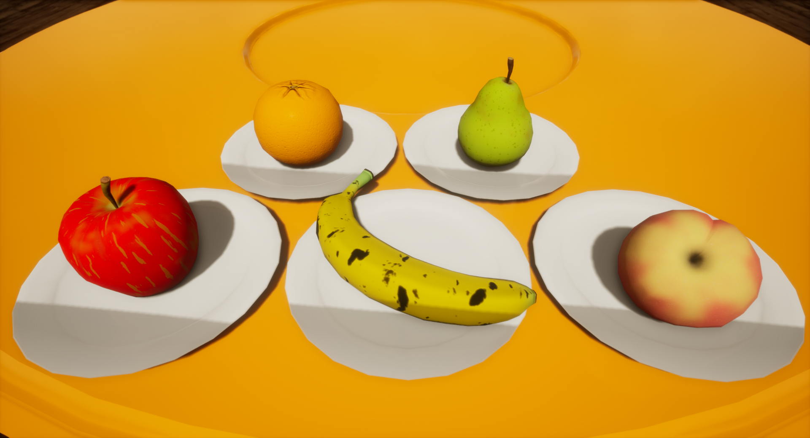

This is a collection of stylized 3D models I made. Everything was modeled on Blender, with the textures being made on Substance Painter. While I did aim for a stylized look, I also wanted to maintain some details, such as bumps on the orange and pear and the yellow scratches on the apple.

<iframe title="Fruit plate" frameborder="0" width="640" height ="360" allowfullscreen mozallowfullscreen="true" webkitallowfullscreen="true" allow="autoplay; fullscreen; xr-spatial-tracking" xr-spatial-tracking execution-while-out-of-viewport execution-while-not-rendered web-share src="https://sketchfab.com/models/b2f08062bfb84d5ea94c1aa596817e76/embed"> </iframe>

Below are some screenshots taken on Unreal Engine.

